::: {.hero-banner-home .home}

::: {.VGL-top}
VAN GALEN
:::

::: {.VGL-bottom}
LAB
:::

::: {.VGL-byline}
Blood aging and leukemia research through data science and experimental biology
:::

:::

Hematopoietic stem cells (HSCs) in the bone marrow produce over 100 billion new blood cells daily. As we age, these stem cells change, which can lead to immune dysfunction and transformation into leukemia. At the Van Galen Laboratory, we study these processes using experimental and computational tools, including single-cell sequencing and bioinformatics. Our goal is to translate a deeper understanding of blood cells into new therapies that improve human health.

::: {.heading-with-lines}
### Data Science Innovation
:::

::: {.grid}
::: {.g-col-12 .g-col-md-6}
Technologies are often the rate-limiting step in understanding complex biological systems. We develop and apply multimodal single-cell sequencing methods alongside bioinformatics, statistical modeling, and machine learning to uncover hidden structure in high-dimensional data. These approaches have led to new insights into blood and immune regulation, including the first comprehensive atlas of AML cell heterogeneity, now widely used as a reference.

*Image from Weng et al., Nature 2024.*
:::
::: {.g-col-12 .g-col-md-6 .text-center}
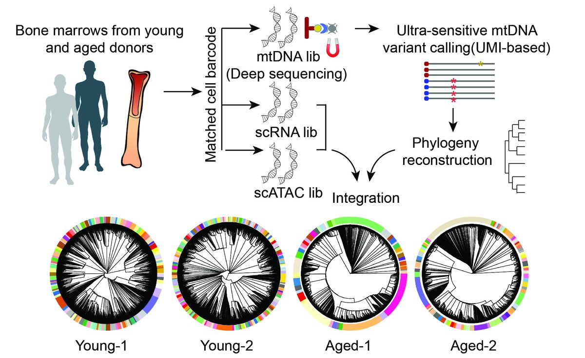{.img-fluid style="max-width: 400px;"}
:::
:::

::: {.heading-with-lines}
### Hematopoietic Stem Cell Aging
:::

::: {.grid}
::: {.g-col-12 .g-col-md-6 .text-center}
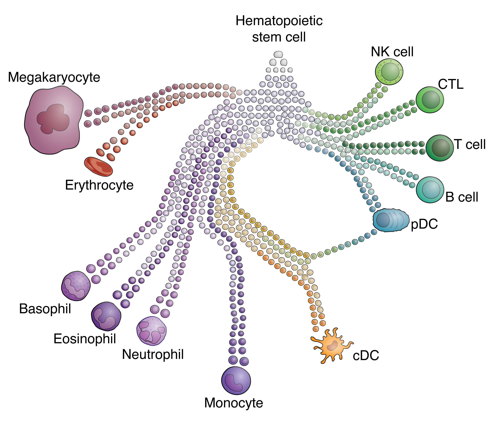{.img-fluid style="max-width: 400px;"}
:::
::: {.g-col-12 .g-col-md-6}
HSCs continuously renew the immune system by generating cells of the myeloid, lymphoid, and erythrocyte/megakaryocyte lineages, but their declining potential contributes to immune dysfunction with age. We are investigating how genetic mutations affect HSCs and exploring strategies to reverse the harmful effects of inflammation. By shedding light on these aging and transformation processes, we aim to increase the human health span.

*Image adapted from Guilliams et al., Immunity 2018.*
:::
:::

::: {.heading-with-lines}
### Acute Myeloid Leukemia Treatment
:::

::: {.grid}
::: {.g-col-12 .g-col-md-6}
AML is one of the deadliest blood cancers, and a major goal of our lab is to develop better treatment strategies. One project focuses on targeting stress response and protein translation pathways, which are changed in AML cells to support their survival. We are testing new drug combinations that show strong synergy in preclinical models.
For patients who undergo bone marrow transplantation, survival improves thanks to anti-tumor immune responses from donor cells. In this context, we have mapped the landscape of immune recovery after transplant, offering insights into new strategies to improve patient outcomes.

*Image shows T cells (symbols) connected by common TCR sequences; from Sariipek et al., American Society of Hematology 2023.*
:::
::: {.g-col-12 .g-col-md-6 .text-center}
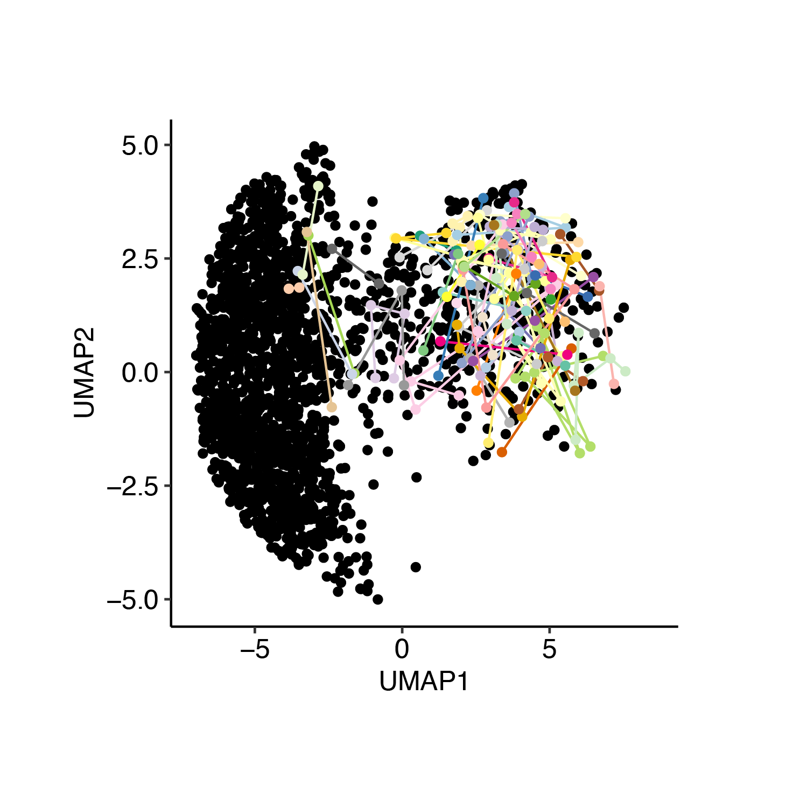{.img-fluid style="max-width: 400px;"}
:::
:::

At the Van Galen Lab, we’re not just advancing the frontier of blood and leukemia research; we’re building a diverse and vibrant scientific community. We welcome students to take part in rigorous research and professional development, preparing the next generation of biomedical leaders. Join us in pushing scientific boundaries while fostering an inclusive and supportive environment for researchers at all levels. 

---

**Our work is made possible by past and present supporters:**

::: {style="text-align: center;"}
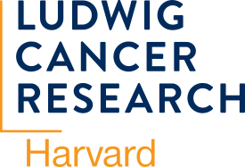{.supporter-logo}
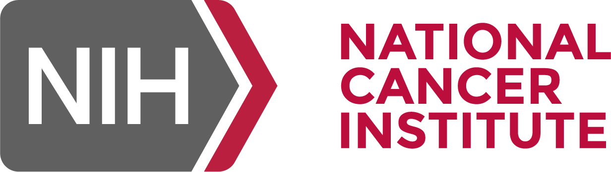{.supporter-logo}
{.supporter-logo}
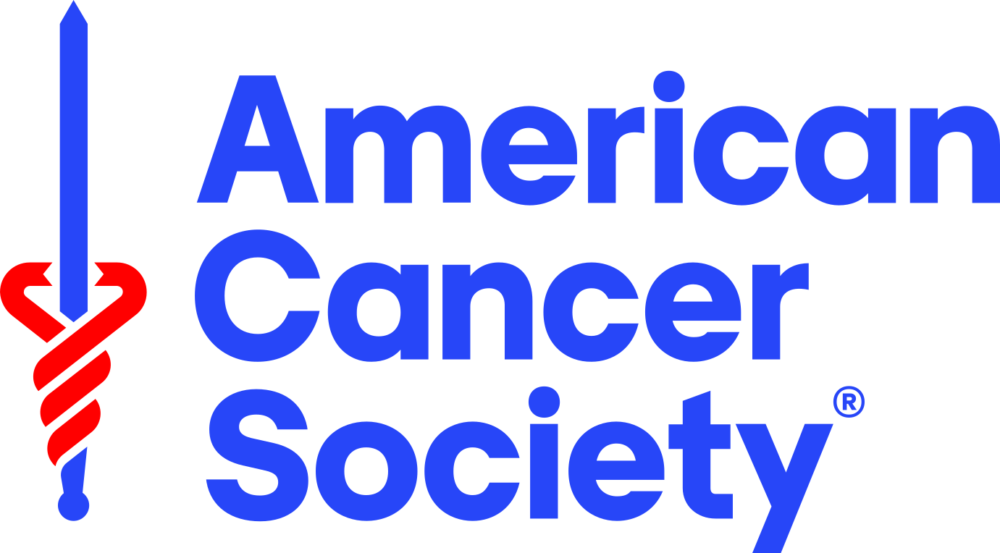{.supporter-logo}
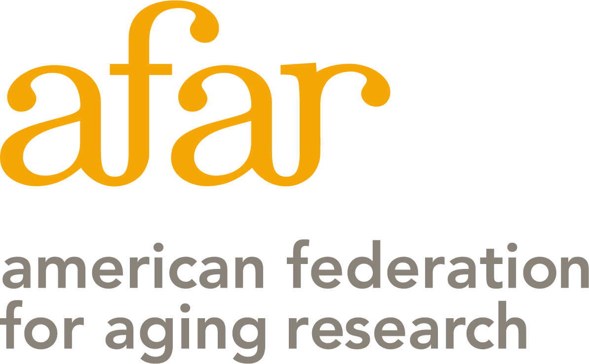{.supporter-logo}
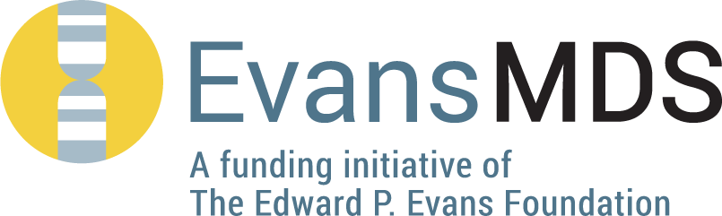{.supporter-logo}
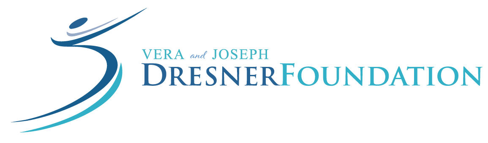{.supporter-logo}
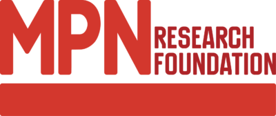{.supporter-logo}
{.supporter-logo}
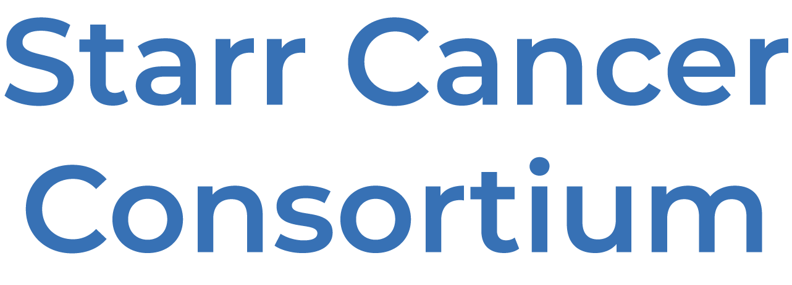{.supporter-logo}
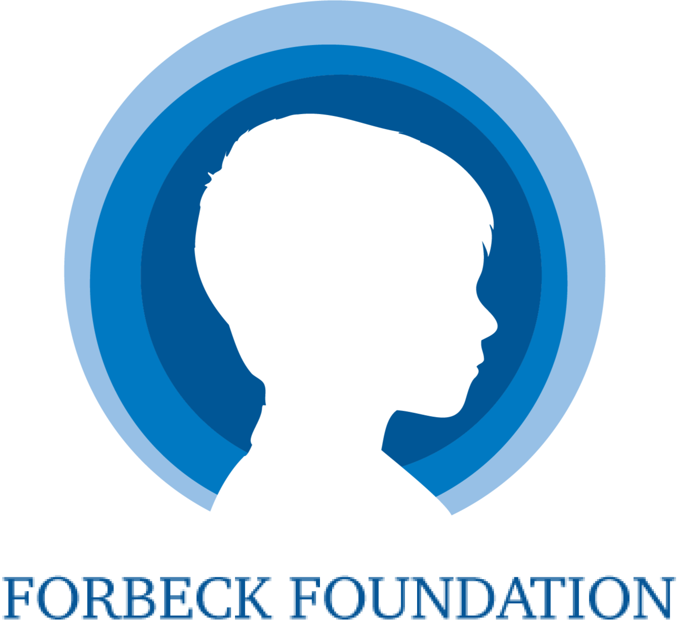{.supporter-logo}
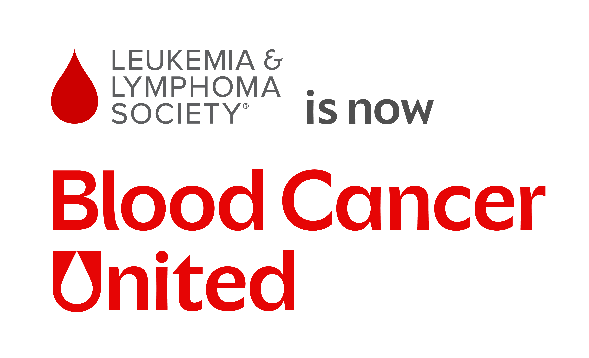{.supporter-logo}
{.supporter-logo}
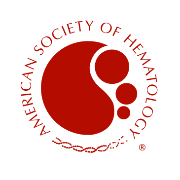{.supporter-logo}
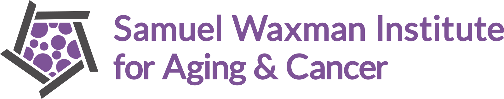{.supporter-logo}
:::

::: {.organizations-bar}
<!-- {.org-logo} -->
{.org-logo style="filter: brightness(0) invert(1);"}
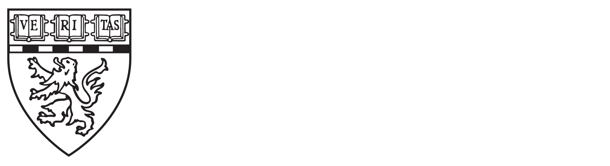{.org-logo style="width:130px; height:auto;"}
{.org-logo style="width:130px; height:auto;"}
<!-- {.org-logo} -->
<!-- {.org-logo} -->
<!-- {.org-logo} -->
<!-- {.org-logo} -->
:::
