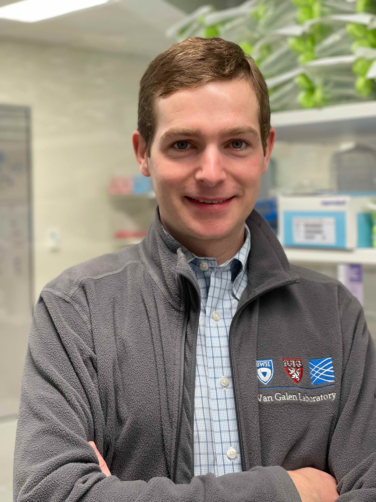
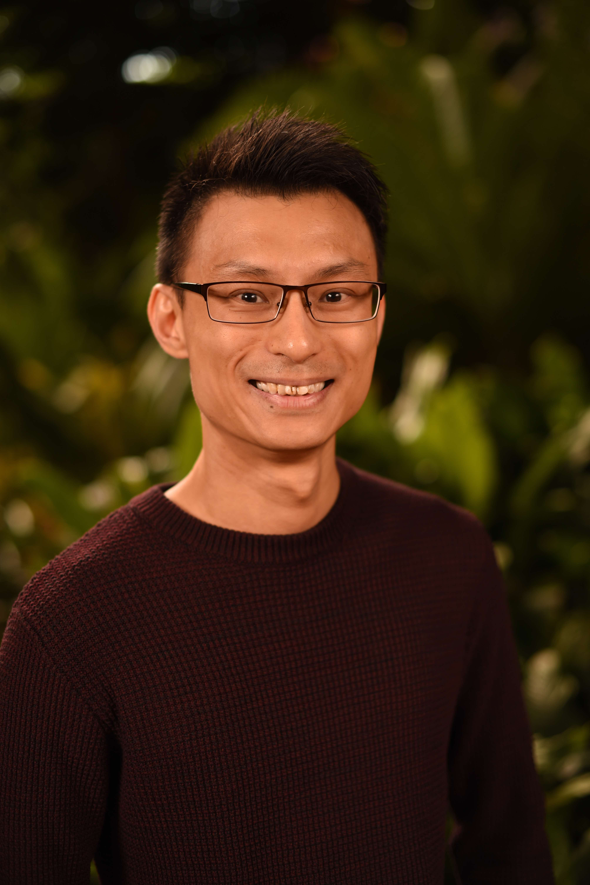
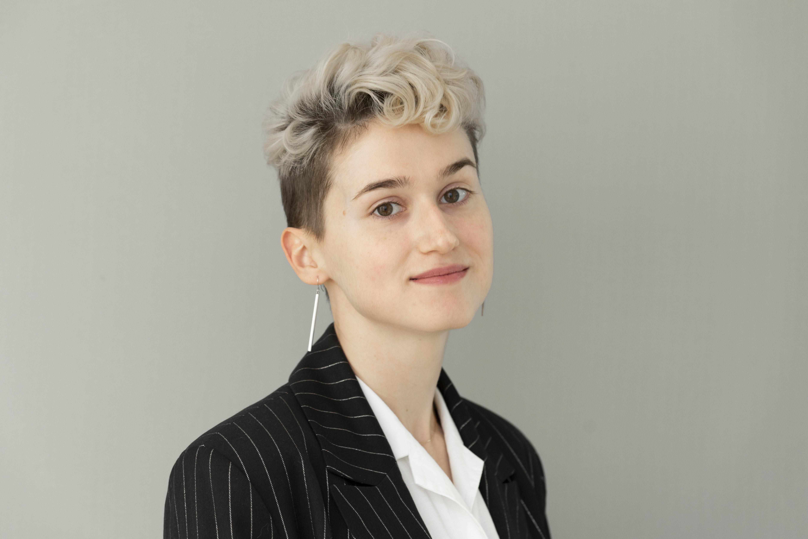
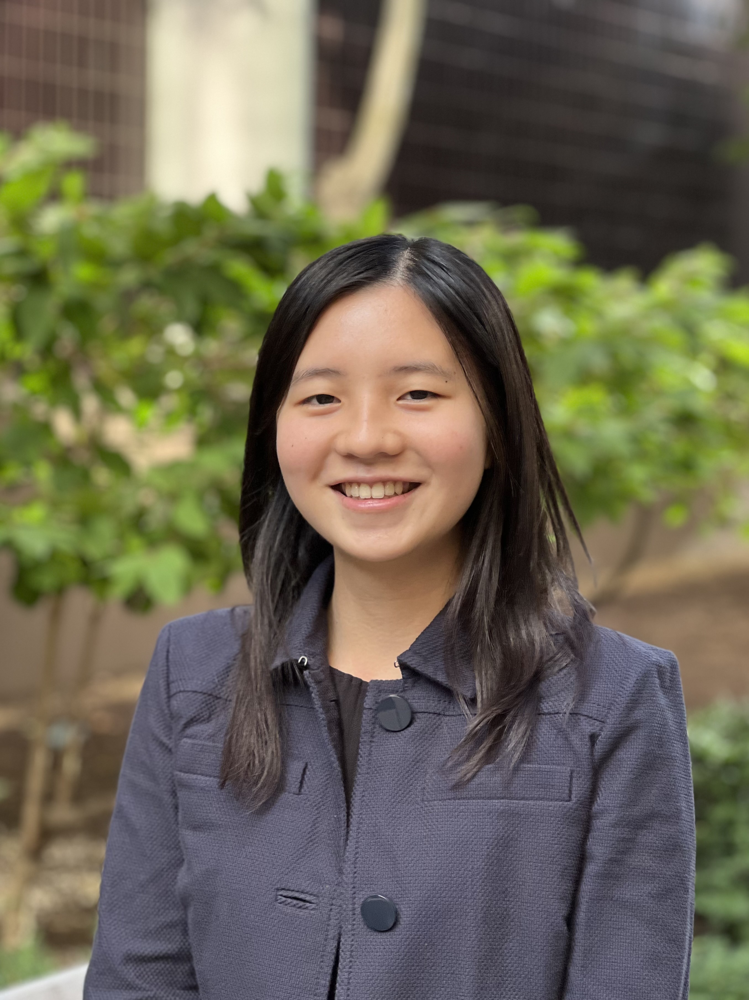
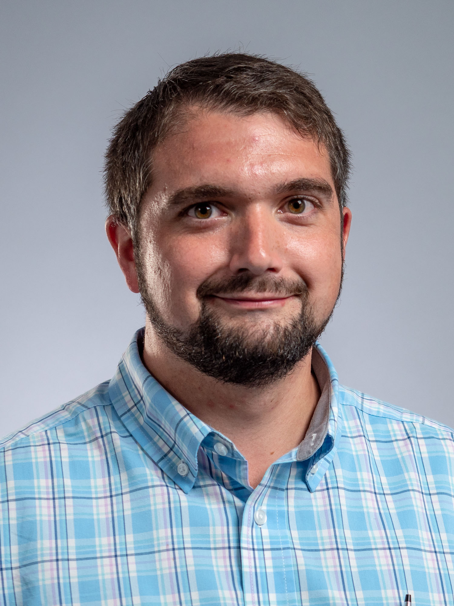
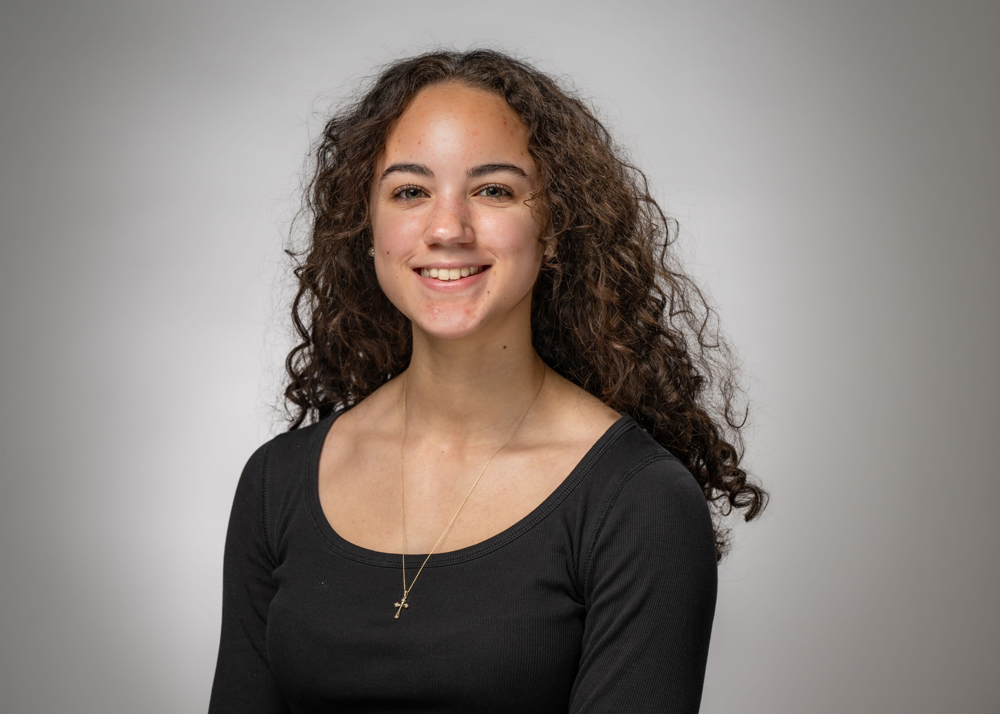
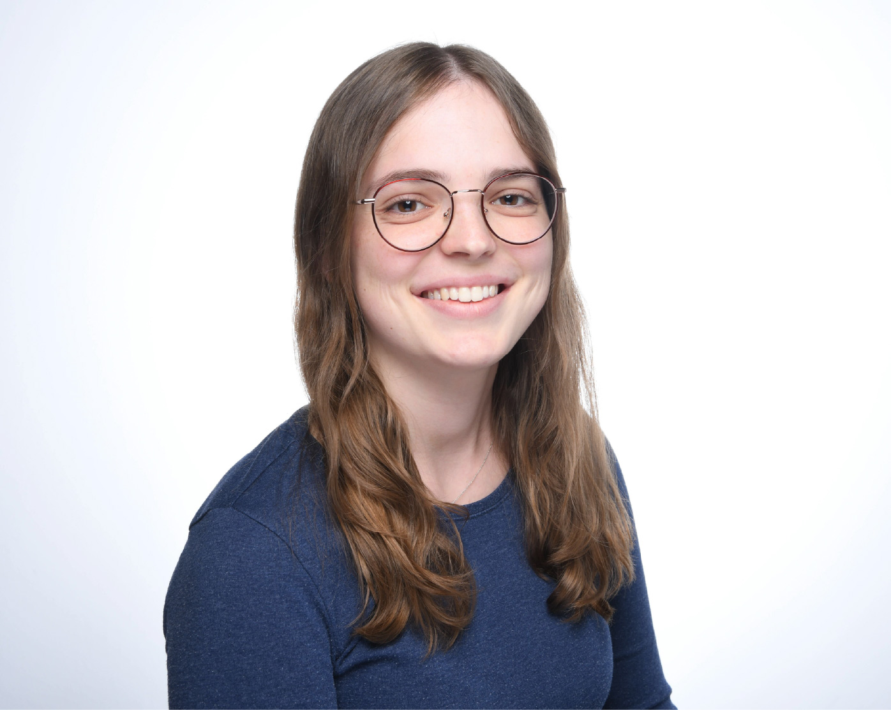

::: {.grid}
::: {.g-col-12 .g-col-md-4}
{style="width:180px; height:250px; object-fit:cover; margin:0;"}

**Peter van Galen, PhD**  
*Principal Investigator*  
<i class="fa-regular fa-envelope"></i> [Email](mailto:pvangalen@bwh.harvard.edu)
&nbsp;<i class="fab fa-bluesky"></i> [Bluesky](https://bsky.app/profile/vangalenlab.bsky.social)  
&nbsp;<i class="fab fa-github"></i> [GitHub](https://github.com/petervangalen)
&nbsp;<i class="fa-brands fa-orcid"></i> [ORCID](https://orcid.org/0000-0002-0735-1570)  
&nbsp;<i class="fas fa-graduation-cap"></i> [Google Scholar](https://scholar.google.com/citations?user=y3NC0VgAAAAJ)
&nbsp;<i class="fas fa-dna"></i> [Addgene](https://www.addgene.org/Peter_van_Galen/)
&nbsp;<i class="fas fa-database"></i> [Figshare](https://figshare.com/authors/Peter_van_Galen/20616098)
:::

::: {.g-col-12 .g-col-md-4}
{style="width:180px; height:250px; object-fit:cover; margin:0;"}

**Yoke Seng Lee, PhD**  
*Postdoctoral Fellow*  
New targeted therapies for acute myeloid leukemia (AML).  
<i class="fa-regular fa-envelope"></i> [Email](mailto:ylee62@bwh.harvard.edu)  
:::

::: {.g-col-12 .g-col-md-4}
{style="width:180px; height:250px; object-fit:cover; margin:0;"}

**Ksenia Safina, PhD**  
*Postdoctoral Fellow*  
Hematopoietic stem cell (HSC) aging and expansion, bioinformatics.  
<i class="fa-regular fa-envelope"></i> [Email](mailto:ksafina@bwh.harvard.edu) 
&nbsp;<i class="fab fa-github"></i> [GitHub](https://github.com/noranekonobokkusu)
:::

::: {.g-col-12 .g-col-md-4}
{style="width:180px; height:250px; object-fit:cover; margin:0;"}

**Basit Salik, PhD**  
*Postdoctoral Fellow*  
HSC aging, leukemia prevention, and immunotherapeutic targeting.  
<i class="fa-regular fa-envelope"></i> [Email](mailto:bsalik@bwh.harvard.edu)
&nbsp;<i class="fab fa-bluesky"></i> [Bluesky](https://bsky.app/profile/basitsalik.bsky.social)
:::

::: {.g-col-12 .g-col-md-4}
{style="width:180px; height:250px; object-fit:cover; margin:0;"}

**Jingting Lin**  
*Graduate Student*  
Protein translation and stress signaling in AML.  
<i class="fa-regular fa-envelope"></i> [Email](mailto:jlin70@bwh.harvard.edu)
&nbsp;<i class="fab fa-github"></i> [GitHub](https://github.com/jtl07)
:::

::: {.g-col-12 .g-col-md-4}
{style="width:180px; height:250px; object-fit:cover; margin:0;"}

**Jonathan Good**  
*Research Technician*  
Single-cell multiomics and lab management.  
<i class="fa-regular fa-envelope"></i> [Email](mailto:jgood1@bwh.harvard.edu)
&nbsp;<i class="fab fa-bluesky"></i> [Bluesky](https://bsky.app/profile/jdgood1.bsky.social)
:::

::: {.g-col-12 .g-col-md-4}
{style="width:180px; height:250px; object-fit:cover; margin:0;"}

**Hailey Tolson**  
*Research Technician*  
Protein translation initiation factors and lab management.  
<i class="fa-regular fa-envelope"></i> [Email](mailto:htolson@mgb.org)  
:::

::: {.g-col-12 .g-col-md-4}
{style="width:180px; height:250px; object-fit:cover; margin:0;"}

**Hanna Frieß**  
*Exchange Student*  
How HSC interactions change with age.  
<i class="fa-regular fa-envelope"></i> [Email](mailto:hfriess@bwh.harvard.edu)  
:::
:::

For alumni, see [Forest](https://vangalenlab.org/forest.html).