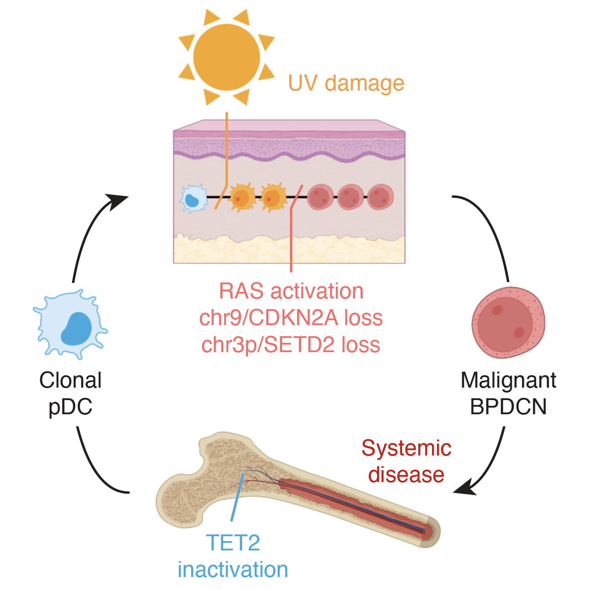
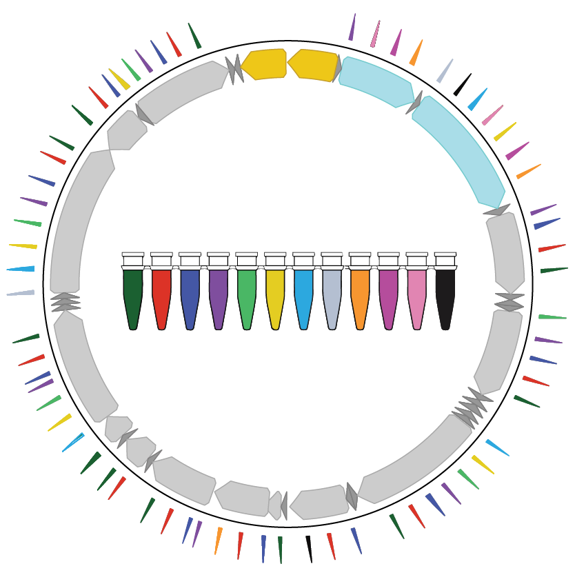
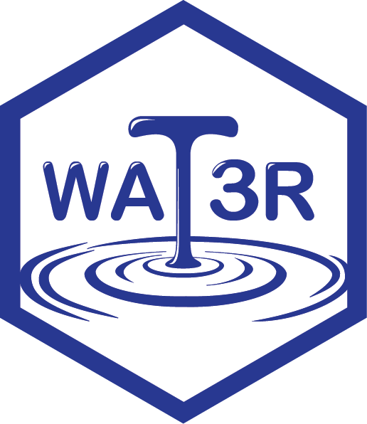
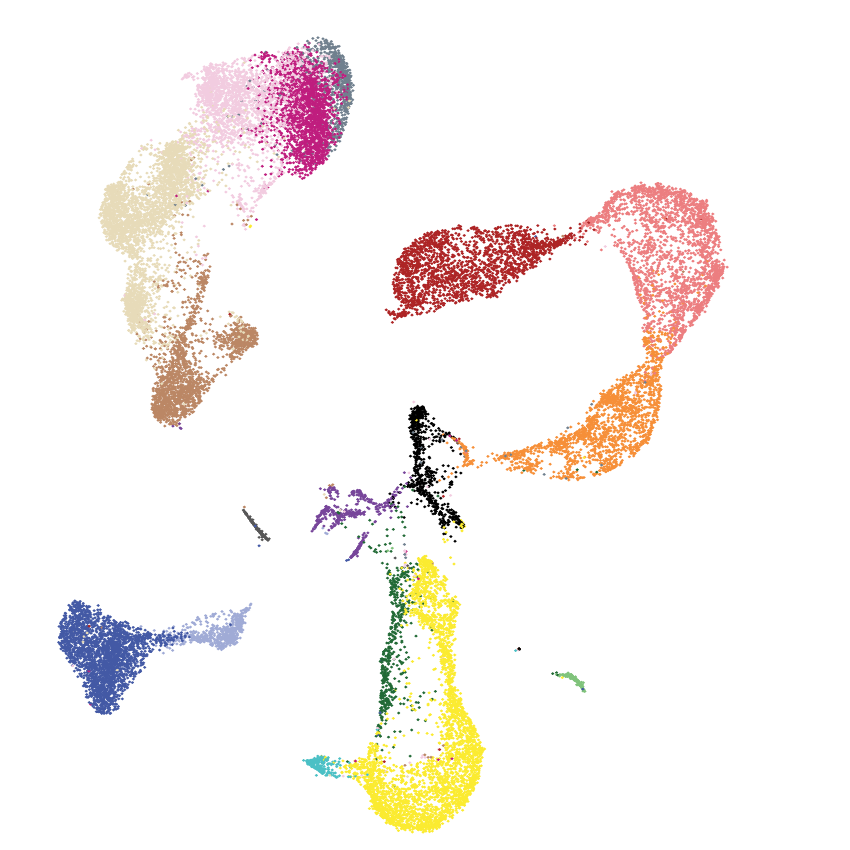
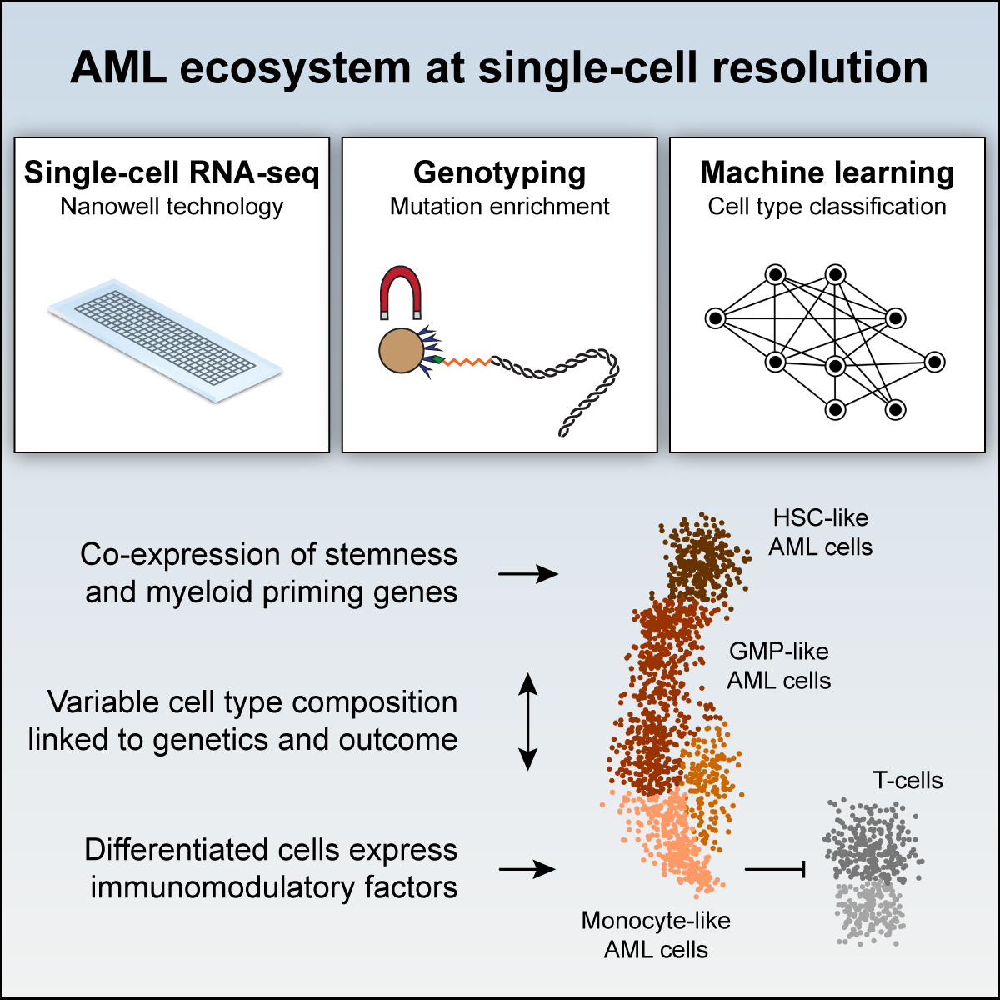
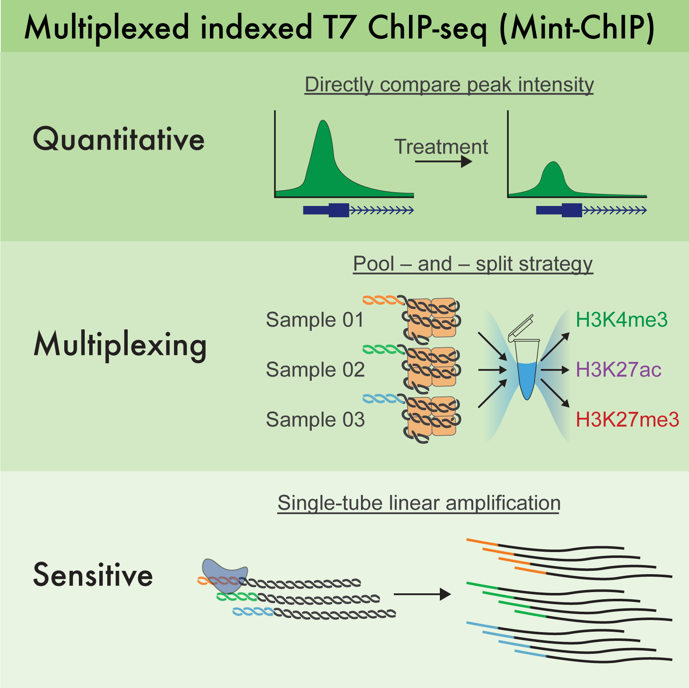
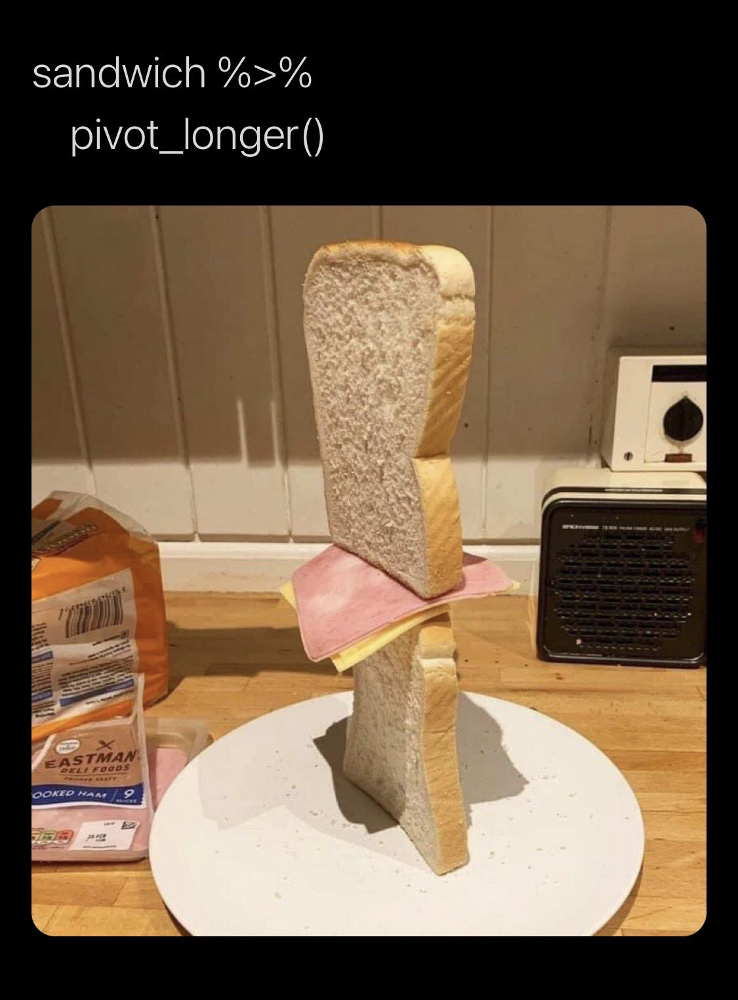

# Data and Analysis

---

### BPDCN EVOLUTION {.custom-position}

::: {.grid}
::: {.g-col-12 .g-col-md-6 .text-center}
{style="width:300px; display:block; margin:5px auto -20px auto;"}
:::
::: {.g-col-12 .g-col-md-6}
**2023** | How pre-leukemic cells in the bone marrow can evolve to a full-blown dendritic cell leukemia after acquiring DNA mutations in the skin.

* <i class="fa-regular fa-file-lines"></i> [Paper](https://www.nature.com/articles/s41586-023-06156-8): Griffin GK *et al.* Ultraviolet radiation shapes dendritic cell leukaemia transformation in the skin. Nature, 2023
* <i class="fab fa-github"></i> [Single-cell_BPDCN](https://github.com/petervangalen/Single-cell_BPDCN): R scripts to analyze the single-cell gene expression and genotyping data.
* <i class="fa-solid fa-dna"></i> [GEO](https://www.ncbi.nlm.nih.gov/geo/query/acc.cgi?acc=GSE227690): Raw and processed sequencing data.
:::
<!-- Additionally, the following links were on the previous Van Galen Lab website. These Seurat files contain gene expression matrices and metadata, including cell annotations and genotyping calls. They can be read into R with readRDS(). The data were generated using 10x 3' v3.1, 10x 3' v3, and Seq-Well S^3 protocols, as indicated in Supplemental Table 3a of the paper. The healthy control object contains 20,411 high-quality cells from six donors. These links are now broken:
* [BM_Seurat_Final.rds](https://www.dropbox.com/s/kjj681rztlw6l5d/BM_Seurat_Final.rds?dl=0): Six healthy controls  
* [Pt1Dx_Seurat_Final.rds](https://www.dropbox.com/s/6urouygij9t2onz/Pt1Dx_Seurat_Final.rds?dl=0): Pt1Dx  
* [Pt1Rem_Seurat_Final.rds](https://www.dropbox.com/s/5vyay5ny2cnv1yv/Pt1Rem_Seurat_Final.rds?dl=0): Pt1Rem  
* [Pt5Dx_Seurat_Final.rds](https://www.dropbox.com/s/4fipdxhr2xx9ycv/Pt5Dx_Seurat_Final.rds?dl=0): Pt5Dx  
* [Pt9Dx_Seurat_Final.rds](https://www.dropbox.com/s/v5t9q7gmbj3oq63/Pt9Dx_Seurat_Final.rds?dl=0): Pt9Dx  
* [Pt10Dx_Seurat_Final.rds](https://www.dropbox.com/s/9by5ngpkfhxlfqt/Pt10Dx_Seurat_Final.rds?dl=0): Pt10Dx  
* [Pt10Rel_Seurat_Final.rds](https://www.dropbox.com/s/2vz0mc34sl0hoke/Pt10Rel_Seurat_Final.rds?dl=0): Pt10Rel  
* [Pt12Dx_Seurat_Final.rds](https://www.dropbox.com/s/motnr4gaylicl7w/Pt12Dx_Seurat_Final.rds?dl=0): Pt12Dx  
* [Pt12Rel_Seurat_Final.rds](https://www.dropbox.com/s/4x24kdyqxregmq1/Pt12Rel_Seurat_Final.rds?dl=0): Pt12Rel  
* [Pt14Dx_Seurat_Final.rds](https://www.dropbox.com/s/df7kirxjyvbvedm/Pt14Dx_Seurat_Final.rds?dl=0): Pt14Dx  
* [Pt15Dx_Seurat_Final.rds](https://www.dropbox.com/s/xif3dxnb84m9mrk/Pt15Dx_Seurat_Final.rds?dl=0): Pt15Dx  
* [Pt16Dx_Seurat_Final.rds](https://www.dropbox.com/s/bwsqdbrt386cgrp/Pt16Dx_Seurat_Final.rds?dl=0): Pt16Dx -->
:::

---

### MAESTER {.custom-position}

::: {.grid}
::: {.g-col-12 .g-col-md-6 .text-center}
{style="width:300px; display:block; margin:5px auto -20px auto;"}
:::
::: {.g-col-12 .g-col-md-6}
**2022** | How mitochondrial DNA mutations can be used to determine the clonal relationships between single cells.

* <i class="fa-regular fa-file-lines"></i> [Paper](https://www.nature.com/articles/s41587-022-01210-8): Miller TE *et al.* Mitochondrial variant enrichment from high-throughput single-cell RNA sequencing resolves clonal populations. Nat Biotechnol, 2022
* <i class="fab fa-github"></i> [MAESTER-2021](https://github.com/petervangalen/MAESTER-2021): Scripts used to analyze the data and generate figures.
* <i class="fab fa-github"></i> [maegatk](https://github.com/caleblareau/maegatk): Mitochondrial Alteration Enrichment and Genome Analysis Toolkit to process `.bam` files with mitochondrial reads to generate heteroplasmy estimation in single cells.
* <i class="fab fa-github"></i> [Mitochondrial_variants](https://github.com/EDePasquale/Mitochondrial_variants): A table of mitochondrial variants, their effects on the resultant proteins, and the potential beneficial/detrimental consequences of mutations.
* <i class="fa-solid fa-dna"></i> [GEO](https://www.ncbi.nlm.nih.gov/geo/query/acc.cgi?acc=GSE182685): Raw and processed sequencing data.
:::
<!-- Additionally, the following datafiles were availabe on the prevous version of the Van Galen Lab website to facilitate script execution. The links are now dead:
* [SW_CellLineMix_All_mr3_maegatk.rds](https://www.dropbox.com/s/0l09x5fxiyd5xey/SW_CellLineMix_All_mr3_maegatk.rds?dl=0): MAESTER mitochondrial variant data: Seq-Well cell line mix (all reads)  
* [SW_CellLineMix_RNAseq_mr3_maegatk.rds](https://www.dropbox.com/s/7sjpfcpuurl61x1/SW_CellLineMix_RNAseq_mr3_maegatk.rds?dl=0): MAESTER mitochondrial variant data: Seq-Well cell line mix (RNA-seq reads only)  
* [TenX_CellLineMix_All_mr3_maegatk.rds](https://www.dropbox.com/s/1m90g0eml3b5dmx/TenX_CellLineMix_All_mr3_maegatk.rds?dl=0): MAESTER mitochondrial variant data: 10x cell line mix (all reads)  
* [TenX_CellLineMix_RNAseq_mr3_maegatk.rds](https://www.dropbox.com/s/dsn5nesmojf8x9m/TenX_CellLineMix_RNAseq_mr3_maegatk.rds?dl=0): MAESTER mitochondrial variant data: 10x cell line mix (RNA-seq reads only)  
* [BPDCN712_Maegatk_Final.rds](https://www.dropbox.com/s/iluh8m29d5aaex2/BPDCN712_Maegatk_Final.rds?dl=0): MAESTER mitochondrial variant data: 10x cell line mix (filtered)  
* [SW_MGH252_A_mr3_maegatk.rds](https://www.dropbox.com/s/ar633pwimnydylb/SW_MGH252_A_mr3_maegatk.rds?dl=0): MAESTER mitochondrial variant data: Seq-Well Glioblastoma region A  
* [SW_MGH252_C_mr3_maegatk.rds](https://www.dropbox.com/s/rgfgitg8xgv834i/SW_MGH252_C_mr3_maegatk.rds?dl=0): MAESTER mitochondrial variant data: Seq-Well Glioblastoma region C  
* [SW_MGH252_PBMC_mr3_maegatk.rds](https://www.dropbox.com/s/8nxtnaucj421cie/SW_MGH252_PBMC_mr3_maegatk.rds?dl=0): MAESTER mitochondrial variant data: Seq-Well Glioblastoma PBMCs  
* [TenX_BPDCN712_All_mr3_maegatk.rds](https://www.dropbox.com/s/kgz69mtwjte5ksk/TenX_BPDCN712_All_mr3_maegatk.rds?dl=0): MAESTER mitochondrial variant data: 10x clonal hematopoiesis sample (all reads)  
* [TenX_BPDCN712_RNAseq_mr3_maegatk.rds](https://www.dropbox.com/s/t8kk0l3b9v8735a/TenX_BPDCN712_RNAseq_mr3_maegatk.rds?dl=0): MAESTER mitochondrial variant data: 10x clonal hematopoiesis sample (RNA-seq reads only)  
* [TenX_Multiome_LLL_mr3_maegatk.rds](https://www.dropbox.com/s/kym01l7arnm00kb/TenX_Multiome_LLL_mr3_maegatk.rds?dl=0): MAESTER mitochondrial variant data: 10x multiome analysis  
* [SW_CellLineMix_expr.RData](https://www.dropbox.com/s/lj4rar21n4j1i5b/SW_CellLineMix_expr.RData?dl=0): scRNA-seq expression data: Seq-Well cell line mix  
* [TenX_CellLineMix_expr.RData](https://www.dropbox.com/s/wrl20ot810ojs2s/TenX_CellLineMix_expr.RData?dl=0): scRNA-seq expression data: 10x cell line mix  
* [TenX_Patient10_expr.RData](https://www.dropbox.com/s/a0c0x3wqcxcxqt4/TenX_Patient10_expr.RData?dl=0): scRNA-seq expression data: 10x clonal hematopoiesis sample  
* [SW_CellLineMix_Seurat_Keep.rds](https://www.dropbox.com/s/31no46hoej0i71v/SW_CellLineMix_Seurat_Keep.rds?dl=0): Seurat object: Seq-Well cell line mix  
* [TenX_CellLineMix_Seurat_Keep.rds](https://www.dropbox.com/s/zkuef1pit4hkipb/TenX_CellLineMix_Seurat_Keep.rds?dl=0): Seurat object: 10x cell line mixing  
* [BPDCN712_Seurat_Genotyped.rds](https://www.dropbox.com/s/4myw8m6ndt7eku3/BPDCN712_Seurat_Genotyped.rds?dl=0): Seurat object: 10x clonal hematopoiesis sample (unfiltered)  
* [BPDCN712_Seurat_Final.rds](https://www.dropbox.com/s/vna1k3k7khazd7j/BPDCN712_Seurat_Final.rds?dl=0): Seurat object: 10x clonal hematopoiesis sample (filtered)  
* [BPDCN712_Seurat_with_TCR.rds](https://www.dropbox.com/s/104j01fbdybko1a/BPDCN712_Seurat_with_TCR.rds?dl=0): Seurat object: 10x clonal hematopoiesis sample (additional metadata) -->
:::

---

### WAT3R {.custom-position}

::: {.grid}
::: {.g-col-12 .g-col-md-6 .text-center}
{style="width:150px; display:block; margin:5px auto -20px auto;"}
:::
::: {.g-col-12 .g-col-md-6}
**2022** | Recovering T cell receptors (TCRs) from 3' single-cell RNA-sequencing.

* <i class="fa-regular fa-file-lines"></i> [Paper](https://academic.oup.com/bioinformatics/article/38/14/3645/6604269): Ainciburu M *et al.* WAT3R: recovery of T-cell receptor variable regions from 3’ single-cell RNA-sequencing. Bioinformatics, 2022
* <i class="fab fa-github"></i> [WAT3R](https://github.com/mainciburu/WAT3R): Pipeline to process data generated by the protocol T-cell Receptor Enrichment to linK clonotypes by sequencing (TREK-seq).
* <i class="fa-brands fa-docker"></i> [Docker](https://hub.docker.com/r/mainciburu/wat3r): Image to run the pipeline
* <i class="fa-solid fa-dna"></i> [GEO](https://www.ncbi.nlm.nih.gov/geo/query/acc.cgi?acc=GSE195956): Raw and processed single-cell RNA and TCR-seq sequencing data.
:::
<!-- Additionally, the processed PBMC data were on the Van Galen Lab website. These links are now dead:
* [PB01_Seurat.rds](https://www.dropbox.com/s/aj64kffjmqto7zo/PB01_Seurat.rds?dl=0): Seurat object with gene expression and cell annotations  
* [PB01_clusters.txt](https://www.dropbox.com/s/h7ahlw4z09myxgl/PB01_clusters.txt?dl=0): Cell annotations  
* [PB01_barcode_results.csv](https://www.dropbox.com/s/5bnn6ttavgyr38f/PB01_barcode_results.csv?dl=0): WAT3R results table, summarized per cell barcode (used commonly)  
* [PB01_barcode_UMI_results.csv](https://www.dropbox.com/s/3hewmrr0piq4yea/PB01_barcode_UMI_results.csv?dl=0): WAT3R results table, summarized per UMI (used less commonly)   -->
:::

---

### T CELLS IN BPDCN {.custom-position}

::: {.grid}
::: {.g-col-12 .g-col-md-6 .text-center}
{style="width:300px; display:block; margin:5px auto -20px auto;"}
:::
::: {.g-col-12 .g-col-md-6}
**2022** | Here we explore the mechanisms of immune dysfuction in a rare dendritic cell leukemia.

* <i class="fa-regular fa-file-lines"></i> [Paper](https://www.frontiersin.org/articles/10.3389/fimmu.2022.809414/abstract): DePasquale EAK *et al.* Single-cell multiomics reveals clonal T-cell expansions and exhaustion in blastic plasmacytoid dendritic cell neoplasm. Front Immunol, 2022
* <i class="fab fa-github"></i> [BPDCN](https://github.com/EDePasquale/BPDCN): Scripts used to analyze the data and generate figures for the paper.
* <i class="fa-solid fa-dna"></i> [GEO](https://www.ncbi.nlm.nih.gov/geo/query/acc.cgi?acc=GSE189431): Raw and processed single-cell RNA and TCR-seq sequencing data.
:::
<!-- Additionally, the following files were on the previous Van Galen Lab website, but the links are now dead. They contain gene expression and cell annotations, not TCR sequencing data (which is on GEO). The data were generated using 10x 3′ v3.0 and v3.1 protocols. The healthy control object contains 25,726 high-quality cells from five donors.
* [Controls.rds](https://www.dropbox.com/s/3d9alcihsfuai3g/Controls.rds?dl=0): Five healthy controls - Integrated Seurat object
* [BPDCN1.rds](https://www.dropbox.com/s/pjudrw1hmcsx0aq/BPDCN1.rds?dl=0): BPDCN1 - Seurat object
* [BPDCN2.rds](https://www.dropbox.com/s/munjmibdcv7aggy/BPDCN2.rds?dl=0): BPDCN2 - Seurat object
* [BPDCN3.rds](https://www.dropbox.com/s/mid15zsuic4h4iu/BPDCN3.rds?dl=0): BPDCN3 - Seurat object
* [BPDCN4.rds](https://www.dropbox.com/s/87i3u0223v18kxd/BPDCN4.rds?dl=0): BPDCN4 - Seurat object
* [BPDCN5.rds](https://www.dropbox.com/s/6x46izpb36l8k8z/BPDCN5.rds?dl=0): BPDCN5 - Seurat object -->
:::

---

### SINGLE-CELL AML {.custom-position}

::: {.grid}
::: {.g-col-12 .g-col-md-6 .text-center}
{style="width:300px; display:block; margin:5px auto -20px auto;"}
:::
::: {.g-col-12 .g-col-md-6}
**2019** | Analysis of acute myeloid leukemia cell heterogeneity.

* <i class="fa-regular fa-file-lines"></i> [Paper](https://www.cell.com/cell/fulltext/S0092-8674(19)30094-7): van Galen P *et al.* Single-cell RNA-seq reveals AML hierarchies relevant to disease progression and immunity. Cell, 2019
* <i class="fab fa-github"></i> [aml2019](https://github.com/BernsteinLab/aml2019): Original code largely written by Volker Hovestadt.
* <i class="fab fa-github"></i> [reanalyze-AML2019](https://github.com/petervangalen/reanalyze-aml2019): Scripts that facilitate the visualization of genes of interest in barplots, violin/sina plots, and heatmaps.
* <i class="fa-solid fa-dna"></i> [GEO](https://www.ncbi.nlm.nih.gov/geo/query/acc.cgi?acc=GSE116256): Raw and processed single-cell RNA and TCR-seq sequencing data.
:::
<!-- Additionally, the following data file was available on the previous Van Galen Lab website with the description: "The following Seurat file is here to facilitate the use of single-cell RNA-seq from diagnosis (day 0) AML samples and healthy controls. The data was generated using Seq-Well. The Seurat object contains 22,600 cells from 22 samples with metadata columns including cell type. Follow-up samples are not included in this file: to access the full dataset, use the GEO link above." The link is now dead (and the datat can be accessed on the second Github repository):
* [Seurat object with single-cel AML data](https://www.dropbox.com/s/399x045zc57fiut/Seurat_AML.rds?dl=0) -->
:::

---

### MINT-CHIP {.custom-position}

::: {.grid}
::: {.g-col-12 .g-col-md-6 .text-center}
{style="width:300px; display:block; margin:5px auto -20px auto;"}
:::
::: {.g-col-12 .g-col-md-6}
**2016** | Here we introduce a new method to enable chromatin immunoprecipitation + sequencing (ChIP-seq) on small cell numbers.

* <i class="fa-regular fa-file-lines"></i> [Paper](https://www.cell.com/molecular-cell/fulltext/S1097-2765(15)00863-1): van Galen P *et al.* A multiplexed system for quantitative comparisons of chromatin landscapes. Mol Cell, 2016
* <i class="fa-regular fa-file-lines"></i> [Protocol](https://www.protocols.io/view/mint-chip3-a-low-input-chip-seq-protocol-using-mul-wbefaje): Step-by-step protocol to carry out Mint-ChIP.
:::
:::

---


# Addgene Plasmids

See also [Addgene website](https://www.addgene.org/Peter_van_Galen/)

```{r}
#| echo: false
#| message: false

library(tidyverse)

# Create sample data
data <- tribble(
  ~Plasmid,
  ~`Gene/Insert`,
  ~`Description`,
  ~Reference,
  "pSMALB-ATF4.5",
  "ATF4 5' UTR, ATF4-eGFP fusion ORF, TagBFP",
  "ATF4 reporter",
  "[van Galen P, Kreso A, Mbong N, *et al.* The unfolded protein response governs integrity of the haematopoietic stem-cell pool during stress. *Nature,* 2014.](https://pubmed.ncbi.nlm.nih.gov/24776803/)",
  "pSMALB-ATF4.12",
  "ATF4 5' UTR, ATF4-eGFP fusion ORF, TagBFP",
  "ATF4 reporter (negative control)",
  "[van Galen P, Kreso A, Mbong N, *et al.* The unfolded protein response governs integrity of the haematopoietic stem-cell pool during stress. *Nature,* 2014.](https://pubmed.ncbi.nlm.nih.gov/24776803/)",
  "pSMALB-ATF4.14",
  "ATF4 5' UTR, ATF4-eGFP fusion ORF, TagBFP",
  "ATF4 reporter (positive control)",
  "[van Galen P, Kreso A, Mbong N, *et al.* The unfolded protein response governs integrity of the haematopoietic stem-cell pool during stress. *Nature,* 2014.](https://pubmed.ncbi.nlm.nih.gov/24776803/)",
  "pMAL",
  "",
  "Bidirectional expression vector (pPGK promoter, GFP)",
  "[van Galen P, Kreso A, Wienholds E, *et al.* Reduced lymphoid lineage priming promotes human hematopoietic stem cell expansion. *Cell Stem Cell,* 2014.](https://pubmed.ncbi.nlm.nih.gov/24388174/)",
  "pMALB",
  "",
  "Bidirectional expression vector (hPGK promoter, TagBFP)",
  "[van Galen P, Kreso A, Wienholds E, *et al.* Reduced lymphoid lineage priming promotes human hematopoietic stem cell expansion. *Cell Stem Cell,* 2014.](https://pubmed.ncbi.nlm.nih.gov/24388174/)",
  "pSMAL",
  "",
  "Bidirectional expression vector (SFFV promoter, GFP)",
  "[van Galen P, Kreso A, Wienholds E, *et al.* Reduced lymphoid lineage priming promotes human hematopoietic stem cell expansion. *Cell Stem Cell,* 2014.](https://pubmed.ncbi.nlm.nih.gov/24388174/)",
  "pSMALB",
  "",
  "Bidirectional expression vector (SFFV promoter, TagBFP)",
  "[van Galen P, Kreso A, Wienholds E, *et al.* Reduced lymphoid lineage priming promotes human hematopoietic stem cell expansion. *Cell Stem Cell,* 2014.](https://pubmed.ncbi.nlm.nih.gov/24388174/)"
)

# Display as table
knitr::kable(data)
```

---

# For Trainees

* [Brigham and Women's Postdoctoral Association](https://www.discoverbrigham.org/pda/) for postdocs
* [Harvard's Bioinformatics and Integrative Genomics PhD Program](https://bmiphd.hms.harvard.edu/big-track/welcome-big) for PhD students
* [Harvard's Biological and Biomedical Sciences (BBS) Program](https://bbsphd.hms.harvard.edu) for PhD students
* [Harvard's Biomedical Informatics Program](https://dbmi.hms.harvard.edu/education/masters-program) for MSc students
* [Dana-Farber/Harvard Cancer Center's Continuing Umbrella of Research Experiences (CURE) Program](https://www.dfhcc.harvard.edu/research/cancer-disparities/students/cure-overview) for student internships
* [Brigham and Women's Student Success Jobs Program](https://www.brighamandwomens.org/about-bwh/community-health-equity/student-success-jobs-program/student-success-jobs-program) for student internships


---

# Learning

### R for Statistical Computing

{style="width:300px; float:right; margin:0 25px 0 20px;"}

* R for Data Science ([book](https://r4ds.hadley.nz))
* TidyTuesday ([videos](https://www.youtube.com/user/safe4democracy/videos))
* ComplexHeatmap ([documentation](https://jokergoo.github.io/ComplexHeatmap-reference/book/))

### Python

* Think Python, How to Think Like a Computer Scientist ([book](https://greenteapress.com/wp/think-python-2e/))
* A Byte of Python ([book](https://python.swaroopch.com/))
* Introduction to Python ([videos](https://www.youtube.com/watch?v=rfscVS0vtbw))

### Bash

* O’Reilly – Bash Scripting and Shell Programming ([videos](https://learning.oreilly.com/videos/bash-scripting-and/9781789807073/9781789807073-video1_1/))

### Other sources

* Bioinformatics Resources Compendium ([by Merle Riedemann](https://docs.google.com/document/d/1h4SFl4Ssjh6QNTxPYuAFHdqlkmFKrdI0OSom-_5S1F4/))
* Harvard Chan Bioinformatics Core ([Workshops](Workshops))
* Ming Tang Genomics ([Github](https://github.com/crazyhottommy))
* 10 Git Commands Every Developer Should Know ([article](https://www.freecodecamp.org/news/10-important-git-commands-that-every-developer-should-know/))

### Cell Type Annotation

Packages for automated cell type annotation.

* [BoneMarrowMap](https://github.com/andygxzeng/BoneMarrowMap)
* [cellmarkeraccordion](https://github.com/TebaldiLab/cellmarkeraccordion)
* [Azimuth](https://azimuth.hubmapconsortium.org/)
* [PanglaoDB](https://panglaodb.se/index.html)
* [Atlas of Blood Cells](http://abc.sklehabc.com/#/home)
* [CellMarker 2.0](https://academic.oup.com/nar/article/51/D1/D870/6775381)
* [CellAssign](https://irrationone.github.io/cellassign/articles/introduction-to-cellassign.html)
* [clustifyr](https://f1000research.com/articles/9-223/v2)

